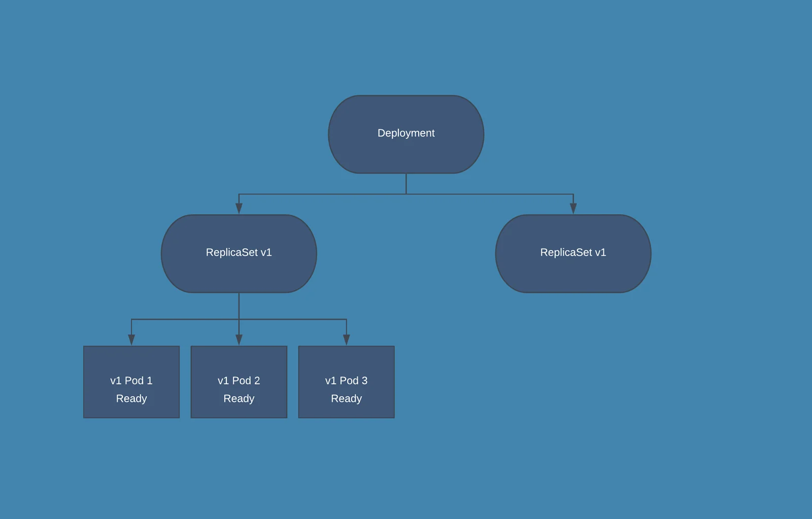

# TP sur kubespray

## Exploration

1. checker l'install depuis le controller **jenkins.lan**
   * `k get nodes`
   * `k cluster-info`
   * `k get pod -A`, à travers tous les namespaces
   * `k get ns`, ns => namespace

2. créer un premier pod
   * `k run <name> --image <image:tag> -- <cmd>`
   * `k run busy --image busybox -- sleep infinity`
   * checker: `k get pod <name> -o wide|yaml|jsonpath '{{ .xxxx.xxx[] }}'`
   * checker: `k get describe pod <name>`
   * checker la ressource (doc): `k explain pod`
   * checker dans le pod: `k exec -it busy -- /bin/bash`

## IaC POD

1. Manifeste

   * dry-run(s)
     + **client**: command not run && apiserver not validated
     + **server**: command not run && apiserver validated (error possible)
     + **none**: command run && apiserver validated but output

   * générer un manifester (YAML) `k run busy --image busybox --dry-run=client -o yaml > /vagrant/k8s/busy.yml`
   * retravailler/renommer le manifeste 
   * et ensuite appliquer depuis le manifeste `k apply -f /vagrant/k8s/busy-dual.yml`

2. plusieurs conteneurs

   * avec plusieurs conteneur dans un pod, distinguer un conteneur
   * `k logs busy-dual -c web`
   ```bash
   k exec -it busy-dual -c busy -- /bin/sh
   # wget -O - http://localhost:80
   # les 2 conteneurs partagent le namespace "net" en particulier les ports
   ```
   

3. volumes de type emptyDir
   
   ```bash
   k exec -it busy-dual -c busy -- /bin/sh
   # echo "content" > /mnt/fic
   ...
   k exec -it busy-dual -c web -- /bin/sh
   # cat /mnt/fic
   ```

## Deploiement: Deployment

1. génération

   ```bash
   k create deployment sample-java \
     --image jenkins.lan:443/stack-java-httpd:1.0 \
     --image jenkins.lan:443/stack-java-tomcat:1.0 \
     --dry-run=client -o yaml > /vagrant/k8s/sample-java-dpl.yml
   ```

2. création du namespace (partition "hermitique" du cluster k8s )

   * `k create ns stack-java --dry-run=client -o yaml > /vagrant/k8s/stack-java-ns.yml`

3. application du déploiement dans le namespace "stack-java"
   * `k apply -n stack-java -f /vagrant/k8s/sample-java-dpl.yml`
   * MIEUX: ajouter le namespace dans le manifeste

   * checker: `k get -n stack-java deployments.apps,pod -o wide`

## cas réél: l'application sample-java

### utiliser les images docker locales dans les noeud

* k8s n'utilise pas nativement le registre local d'images docker, 
  mais son propre registre via `crictl`

```bash
# export import docker / export cri (k8s)
docker save jenkins.lan:443/stack-java-httpd:1.0 -o httpd.tar
sudo ctr -n=k8s.io images import httpd.tar
sudo crictl images | grep httpd
```

* adminstration de crictl comme docker: 
  + Ex: `sudo crictl rmi $(sudo crictl images -f dangling=true -q)`

### mieux: connecter le déploiement au registre à la volée via un Secret

```bash
k create secret generic regcred \
  --from-file=.dockerconfigjson=/home/vagrant/.docker/config.json \
  --type=kubernetes.io/dockerconfigjson \
  --dry-run=client -o yaml > /vagrant/k8s/registry-secret.yml
```

* test: `k get secret -n stack-java regcred -o="jsonpath={.data.\.dockerconfigjson}" | base64 --decode`

* REM: le fichier `/home/vagrant/.docker/config.json` contient un secret encodé en base64 => pas CHIFFRE
  => utiliser le `credsStore` Docker
* REM2: le secret en yml est encodé en base64 => pas CHIFFRE
  => utiliser les ressources Encryption (etcd, api ...)

* REM3: configurer un accès insecure au registre dans k8S
  + exécuter le script `/home/k8s/insecure_containerd_config.sh`
  + dans les noeuds

### mise à jour du déploiement

1. mettre en échelle manuelle : 

* `k scale -n stack-java deployment sample-java --replicas 3`
  => pas immutable ET pas de révision (historique des travaux)

* `k edit -n stack-java deployments.apps sample-java`
  => modif directe de la config de la ressource dans etcd
  => procédure d'urgence
  => sans filet !!
  => pas de révision

* MIEUX : `k apply -f ...` : écraser l'état (IMMUTABLE)

2. mise à jour de l'image : 

* `k set image -n stack-java deployment/sample-java stack-java-tomcat=jenkins.lan:443/stack-java-tomcat:1.1`
  + => trace de changement mais pas d'explication: `k rollout -n stack-java history deployment sample-java`

* MIEUX: IAC `k apply -f ...` + ajout `metada.annotations.kubernetes.io/change-cause`
  + `k rollout history` => voit la description du changement
  + `k rollout -n stack-java undo deployment/sample-java --to-revision 1`
  + documenter le rollback a posteriori: `k annotate -n stack-java deployments.apps sample-java kubernetes.io/change-cause="rollback to 1.0" --overwrite`
  
3. mécanique de la **rolling update**

    

### mise en réseau

* exposition au sens k8s != exposition au sens docker
* exposition au sens k8s == **publication** au sens docker

* ajouter un **service** à un déploiement

```bash
k expose -n stack-java deployment sample-java \
--port 80 \
--target-port 8080 \
--dry-run=client -o yaml > /vagrant/k8s/sample-java-svc.yml
```

#### par défaut: on a un **ClusterIP**: 
  + une IP dispo dans le cluster
  + un port
  + un dns qui est le `metadata.name` accessible dans le namespace
  + un Fully Qualified Domain Name: accessible dans la totalité du cluster => il faudra ajouter des **NetPolicies**
  + ce service ne permet pas d'entrer le flux externe => communication inter-pod

* test: `k exec -n stack-java busy -- wget -O - http://sample-java`


* test (FQDN from outside namespace): `k exec busy-dflt -- wget -O - http://sample-java.stack-java.svc.cluster.local`
  => A PRIORI communication inter namespace

#### le NodePort: 

* rediriger le port du clusterIP sur un port sur tous les noeuds worker, sur toutes les interfaces (privées / publiques) par défaut

#### on ajoute un LB: load balancer

* utilisation du manifest du LB MetalLB

[ici](https://github.com/metallb/metallb)

* installation: `kubectl apply -f https://raw.githubusercontent.com/metallb/metallb/v0.13.7/config/manifests/metallb-native.yaml`

* checks:

```bash
## vérif des pods (1 par noeud)
kubectl get pod -n metallb-system
## vérif de la ressource ipadresspoll (pour les ips externes uniques de nos déploiements)
k get customresourcedefinition.apiextensions.k8s.io/ipaddresspools.metallb.io -n metallb-system
## pas de  pool par défaut
kubectl get ipaddresspools -n metallb-system
```

* configuration de la pool d'ip en mode couche 2 (L2)

  + `k apply -f /vagrant/k8s/ipaddresspool-metallb.yml`


## gestion centralisée d'une application dans k8S

* TIP: `k delete -n stack-java all --all`

* utilisation d'un manifeste **kustomization.yml**
  + centralisant les ressources de l'application
  + lancement `k apply -k .` dans l'emplacement du manifeste
  + test: `k kustomize`
  + désinstaller: `k delete -k .`


## installer prometheus / grafana sur le cluster

* helm installé (cf install_k8s.sh)
* **HELM** est un gestionnaire de paquet pour les *collections de ressources k8s* , A.K.A **Charts**

### gérer les dépôt et le cache (commme apt-get)

```bash
# ajout d'un dépôt tiers 
helm repo add prometheus-community https://prometheus-community.github.io/helm-charts
helm update repo
```

### créer des valeurs custom pour notre cluster

* `helm show values prometheus-community/kube-prometheus-stack`
* pg-custom-values.yml

```yaml
prometheus:
  service:
    type: NodePort
grafana:
  service:
    type: NodePort
```

* installer avec ces valeurs

```bash
# créer un namespace pour le monitoring
k create ns monitoring

# placer le namespace monitoring comme ns par défaut
# permet d'éviter le -n monitoring sur toutes les commandes !
k config set-context --current --namespace=monitoring

# install dry-run pour avoir la structure d'un chart
# utilisant massivement des templates !!!
helm install kube-prometheus-stack prometheus-community/kube-prometheus-stack -f /vagrant/k8s/pg-custom-values.yml -n=monitoring --dry-run=client -o yaml > /vagrant/k8s/pg-chart.yml

# Installation avec upgrade dans le ns monitoring déjà configuré et sans dry-run pour le faire vraiment !!!
helm upgrade --install kube-prometheus-stack prometheus-community/kube-prometheus-stack  -f /vagrant/k8s/pg-custom-values.yml 

```

### accéder via le nodePort (n'importe quel noeud sur les ports)

* `k get svc`: TYPE => NodePort , PORTS => xxxxx / yyyyy
* `k get nodes -o wide`: EXTERNAL-IP => x.y.z.t
* accéder à `x.y.z.t:xxxxxx` pour prometheus et `x.y.z.t:yyyyy` pour Grafana

### authentfication sur Grafana

```bash
## username
k get secret kube-prometheus-stack-grafana -o jsonpath="{.data.admin-user}" | base64 --decode ; echo
# => admin

k get secret kube-prometheus-stack-grafana -o jsonpath="{.data.admin-password}" | base64 --decode ; echo
# => prom-operator
```
* observer les Dashboards dans grafana pour voir les ressources de base du cluster !!!


